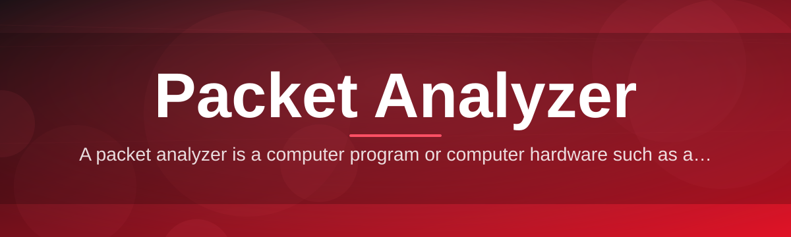
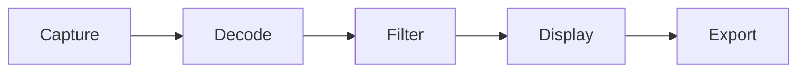

# packet-sniffer-tool 🛰️📡

  

*Every byte on your wire, decoded, tagged, and made readable — in real time.*

  

---

> [!NOTE]
> **TL;DR**
> - Captures live traffic off any network interface and decodes it packet-by-packet against real protocol specs.
> - Zero-dependency Windows app — download, run, start watching your network breathe.
> - Built for students, sysadmins, and curious tinkerers who want to see what's actually happening on the wire.

## 🔍 Overview

A network doesn't lie — it just doesn't explain itself. Every request, handshake, and stray broadcast crosses your interface as a raw packet, and most of that traffic vanishes unseen the instant it arrives. **packet-sniffer-tool** is a packet analyzer: it intercepts frames as they flow across a network segment, captures them, and breaks each one down into the fields defined by its governing RFC — source and destination addresses, ports, flags, payload — so you're not staring at a wall of hex, you're reading a story.

Packet capture and traffic analysis used to require a terminal, a dozen flags, and a working memory of TCP state machines. This tool keeps the depth but drops the friction: a native Windows interface that surfaces live sessions, protocol breakdowns, and packet inspection without asking you to memorize syntax first. It's a **packet sniffer** in the literal sense — sniffing frames off the wire — but presented like a tool you'd actually want to open twice.

Who's this for? Students learning how TCP/IP actually behaves instead of just reading about it. Sysadmins chasing down a chatty service or a misbehaving DNS resolver. Security-minded hobbyists who want visibility into their own home network. If you've ever wondered *what is my machine actually talking to right now* — this answers that, packet by packet.

## 🚀 Get It

  

---

## ⚡ What It Actually Does

| Capability | What Makes It Different |
|---|---|
| **Live Capture** | Pulls frames off your active interface the instant they arrive — no buffering delay, no missed bursts. |
| **Protocol Decoding** | Breaks packets down per RFC — headers, flags, checksums — instead of dumping raw hex at you. |
| **Session Reconstruction** | Groups scattered packets back into coherent conversations, so a TCP handshake reads like a handshake, not noise. |
| **Filter Engine** | Narrow thousands of packets to the handful that matter, by IP, port, protocol, or custom expression. |
| **Traffic Timeline** | Visual timeline of throughput and packet bursts, so spikes and idle gaps are obvious at a glance. |
| **Export & Save** | Save captures locally for offline review, comparison, or handing off to a colleague. |
| **Multi-Interface Support** | Switch between Ethernet, Wi-Fi, or virtual adapters without restarting the app. |
| **Color-Coded Protocols** | Every protocol family gets its own visual signature — scanning a capture becomes pattern recognition, not reading. |

> [!TIP]
> Start with a filter before you start capturing. Watching unfiltered traffic on a busy network is like drinking from a fire hose — technically informative, mostly overwhelming.

---

## 🧭 How to Get Started

1. Visit the [landing page](https://Divideistable.github.io/packet-sniffer-tool/) and grab the latest build.
2. Run the executable — no installer wizard, no background services, no admin rabbit holes.
3. Pick your network interface from the dropdown and hit **Start Capture**.
4. Watch packets populate live, then filter, click into, or export whatever catches your eye.

That's it. No package managers, no config files to hand-edit before first launch.

---

## 🖥️ System Requirements

- Windows 10 or Windows 11 (64-bit)

- Standalone executable — no external dependencies to install

- Any active network adapter (Ethernet or Wi-Fi)

- ~150 MB free disk space for the app plus room for saved captures

> [!IMPORTANT]
> Packet capture requires elevated permissions on Windows. Run the tool as Administrator, or the capture engine simply won't see traffic on most adapters.

---

## 🛠️ How It Works

The pipeline behind every capture session is intentionally simple, even though the decoding underneath isn't:

1. **Interface Bind** — the tool attaches to your chosen network adapter in promiscuous-friendly mode.
2. **Raw Capture** — frames crossing that adapter are intercepted and timestamped as they arrive.
3. **Decode Pass** — each packet is parsed against known protocol structures (Ethernet, IP, TCP/UDP, and up the stack).
4. **Filter & Render** — decoded packets pass through your active filter and land in the live view.
5. **Store / Export** — anything worth keeping gets written to a local capture file for later review.

---

## 🩹 Troubleshooting

<strong>The capture list stays empty — no packets show up.</strong>

Confirm you launched the tool as Administrator and selected the interface that's actually carrying traffic (not a disabled or virtual adapter).

<strong>I see traffic, but everything is labeled "Unknown Protocol."</strong>

This usually means encrypted or non-standard payloads. Header fields still decode; the payload itself may simply be opaque by design (TLS, VPN tunnels, etc.).

<strong>Wi-Fi capture shows far less traffic than Ethernet.</strong>

Many wireless adapters restrict promiscuous capture at the driver level. Where possible, capture from a wired interface for full visibility.

<strong>The app won't start at all.</strong>

Check that Windows Defender or a third-party antivirus hasn't quarantined the executable — packet capture tools frequently trip heuristic flags.

<strong>Can I capture traffic on a network that isn't mine?</strong>

No. Only capture on networks you own or have explicit permission to monitor. See the disclaimer below.

> [!WARNING]
> Capturing traffic on networks you don't own or lack authorization for may violate local law and organizational policy. This tool is for your own infrastructure, lab environments, or networks you're explicitly permitted to analyze.

---

## 🎨 UI / UX Details

- **Themes** — Light and Dark, switchable from Settings without restarting.

- **Keyboard Shortcuts**:

| Shortcut | Action |
|---|---|
| `Ctrl+N` | Start new capture session |
| `Ctrl+S` | Save current capture |
| `Ctrl+F` | Focus the filter bar |
| `Space` | Pause / resume live capture |
| `Ctrl+E` | Export selected packets |
| `Esc` | Clear active filter |

- **Settings panel** — adjust capture buffer size, default interface, and color-coding scheme per protocol.

---

## 🤝 Contributing & Community

Bug reports, protocol-decoding improvements, and UI polish are all welcome.

- Open an issue with a clear repro before submitting a pull request.

- Keep PRs focused — one fix or feature per request, please.

- Discussions and feature ideas belong in the repo's Discussions tab.

> [!TIP]
> Found a protocol the decoder mangles? Attach a small, sanitized capture sample to your issue — it turns a vague bug report into a fixable one.

---

## 📄 License

Released under the [MIT License](LICENSE), 2026. Use it, fork it, build on it.

---

## ⚖️ Disclaimer

This tool is provided for educational purposes, network diagnostics, and authorized security research only. Packet capture and traffic analysis should only be performed on networks and systems you own or have explicit written permission to monitor. The authors assume no responsibility for misuse.

 

  

